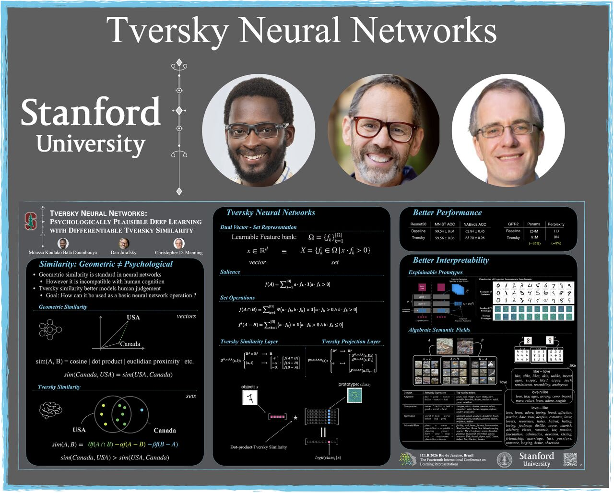

# Official pytorch library for Tversky Neural Networks


## Links
- [web site](https://mdoumbouya.github.io/article_0007_tversky_neural_networks.html)
- [pytorch library](https://github.com/mdoumbouya/tversky) (this repository)
- [ICLR 2026 Experiments](https://github.com/mdoumbouya/tversky-networks-iclr2026) 
- [ICLR 2026 Paper](https://openreview.net/pdf?id=koKWoKaMrE)
- [ICLR 2026 Page](https://iclr.cc/virtual/2026/poster/10007748) 
- [ICLR 2026 High Resolution Poster](https://iclr.cc/media/PosterPDFs/ICLR%202026/10007748.png)


 [](https://github.com/mdoumbouya/tversky/actions/workflows/tests.yml) [](https://github.com/mdoumbouya/tversky/actions/workflows/pypi.yml) 


## Installation
Note: tversky requires PyTorch ≥ 2.0. Install it first following the instructions at https://pytorch.org/get-started. Then run:
```
pip install tversky
```

## Notes
- The code used to reproduce the experiments presented in our [ICLR 2026 paper](https://openreview.net/pdf?id=koKWoKaMrE) is located in the [tversky-networks-iclr2026](https://github.com/mdoumbouya/tversky-networks-iclr2026) repository. This library was forked that repository. That repository does not use this library.

## Component: Tversky Similarity Layer
```python
from tversky import nn as tnn

sim_layer = tnn.TverskySimilarity(
    embedding_dim=64,
    fbank_size=128,
    similarity_model='contrast',
    normalize=False
)
```

## Component: Tversky Projection Layer

```python
from tversky import nn as tnn

proj_layer = tnn.TverskyProjection(
    embedding_dim=64,
    class_count=10,
    fbank_size=128,
    similarity_model='contrast',
    normalize=False
)
```


## MNIST Example
Example of neural network that employs Tversky projection to model MNIST.

```python
import torch
import torch.nn as nn
import torch.nn.functional as F

from tversky import nn as tnn

class MnistNet(nn.Module):
    def __init__(self, fbank_size: int):
        super().__init__()

        self.conv1 = nn.Conv2d(1, 12, 3, padding="same")
        self.conv2 = nn.Conv2d(12, 12, 3, padding="same")
        self.pool2 = nn.MaxPool2d(2)

        self.conv3 = nn.Conv2d(12, 12, 3, padding="same")
        self.conv4 = nn.Conv2d(12, 12, 3, padding="same")
        self.pool4 = nn.MaxPool2d(2)

        self.conv5 = nn.Conv2d(12, 12, 3, padding="same")
        self.conv6 = nn.Conv2d(12, 36, 3, padding="same")

        self.tproj  = tnn.TverskyProjection(
            embedding_dim=36,
            class_count=10,
            fbank_size=fbank_size,
            similarity_model="contrast",
            intersection_reduction="product", 
            difference_reduction="ignorematch",
            normalize=False,
        )

    def forward_conv(self, x):
        x = self.conv2(F.relu(self.conv1(x)))
        x = self.pool2(x)

        x = self.conv4(F.relu(self.conv3(x)))
        x = self.pool4(x)

        x = self.conv6(F.relu(self.conv5(x)))
        x = x.mean((-2, -1))

        return x

    def forward(self, x):
        x = self.forward_conv(x)
        return self.tproj(x)
    
    def compute_salience(self, x):
        x = self.forward_conv(x)
        feature_measures = x @ self.tproj.feature_bank.weight.T
        salience_measures = F.relu(feature_measures).sum(-1)
        return salience_measures
```

Notes:
- See [tests/test_mnist.py](tests/test_mnist.py) for a test case based on this neural network.
- To run the test, execute:`make test-mnist`
- See [tests/outputs/mnist/report.md](tests/outputs/mnist/report.md) for the related test report.

## License
[LICENSE.txt](https://github.com/mdoumbouya/tversky/blob/main/LICENSE.txt)


## Citation
If you use this work, please cite the following paper:

```
@inproceedings{doumbouya2026tversky,
    title={Tversky Neural Networks: Psychologically Plausible Deep Learning with Differentiable Tversky Similarity},
    author={Moussa Koulako Bala Doumbouya and Dan Jurafsky and Christopher D Manning},
    booktitle={The Fourteenth International Conference on Learning Representations},
    year={2026},
    url={https://openreview.net/forum?id=koKWoKaMrE}
}
```
