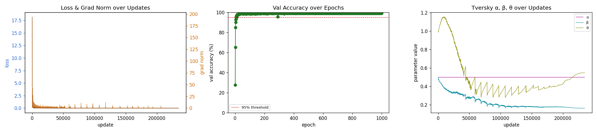
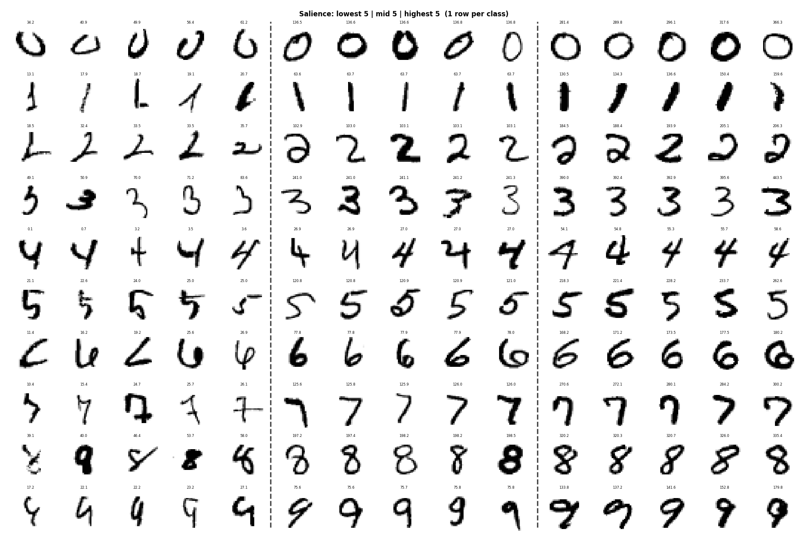
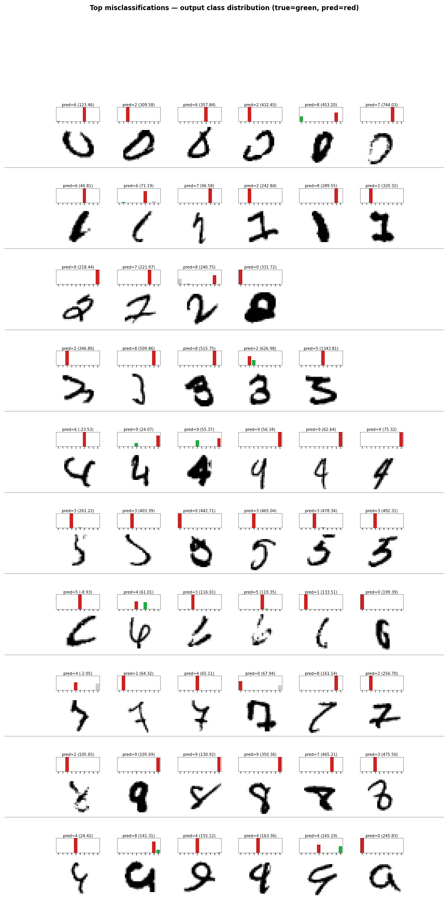

# MNIST Test Report

## Model

| | |
|---|---|
| Parameters | 10,935 |
| Device | mps |

```
MnistNet(
  (conv1): Conv2d(1, 12, kernel_size=(3, 3), stride=(1, 1), padding=same)
  (conv2): Conv2d(12, 12, kernel_size=(3, 3), stride=(1, 1), padding=same)
  (pool2): MaxPool2d(kernel_size=2, stride=2, padding=0, dilation=1, ceil_mode=False)
  (conv3): Conv2d(12, 12, kernel_size=(3, 3), stride=(1, 1), padding=same)
  (conv4): Conv2d(12, 12, kernel_size=(3, 3), stride=(1, 1), padding=same)
  (pool4): MaxPool2d(kernel_size=2, stride=2, padding=0, dilation=1, ceil_mode=False)
  (conv5): Conv2d(12, 12, kernel_size=(3, 3), stride=(1, 1), padding=same)
  (conv6): Conv2d(12, 36, kernel_size=(3, 3), stride=(1, 1), padding=same)
  (tproj): TverskyProjection(
    (feature_bank): Embedding(36, 36)
    (prototypes): Embedding(10, 36)
  )
)
```

## Results

| | |
|---|---|
| Val accuracy | 99.09% |
| Last train loss | 0.0000 |
| Threshold | 95.00% |
| Pass | ✓ |

## Training curves



## Salience

One row per class (0–9): 5 lowest salience | 5 mid salience | 5 highest salience. Salience value shown above each image.



## Misclassifications

One row per true class (0–9). Each cell shows an image the model got wrong, with the predicted label in red.


